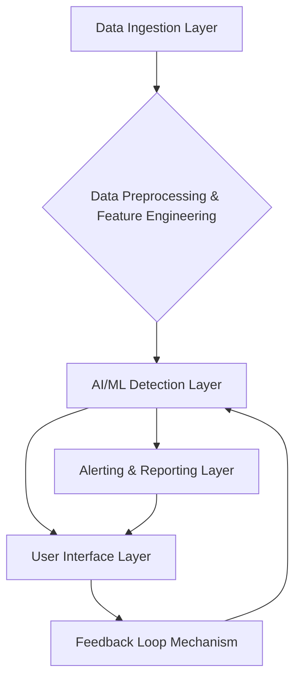

# AI-Powered Scammer Detector

## Project Overview

This project outlines the design and architecture of a comprehensive AI-powered system aimed at detecting and mitigating various types of online scams. In an era where scamming techniques are constantly evolving and becoming more sophisticated, this system leverages advanced Artificial Intelligence and Machine Learning models to identify fraudulent activities across multiple communication channels and data sources. Designed as a robust and scalable solution, it addresses the critical need for enhanced cybersecurity measures against modern scam threats.

## Problem Statement

The digital landscape is increasingly plagued by diverse and evolving scamming techniques, including sophisticated phishing attacks, smishing, fake job offers, mobile money fraud, and the rapid spread of misinformation. Traditional detection methods often fall short against these adaptive threats, leading to significant financial losses, identity theft, and erosion of trust. The challenge lies in developing an intelligent system that can not only identify known scam patterns but also adapt to novel fraudulent schemes, while also addressing critical ethical considerations such as bias and privacy.

## Solution: AI-Powered Scammer Detector

Our solution proposes a multi-layered, AI-driven system capable of ingesting, processing, and analyzing various forms of data to detect scam indicators. The system is designed with modularity to ensure adaptability and continuous improvement, incorporating a feedback loop mechanism for ongoing model refinement.

## Key Features

The AI-Powered Scammer Detector will incorporate the following key features:

*   **Multi-Channel Data Ingestion:** Ability to process data from emails, SMS/messaging platforms, web content, and simulated transactional data.
*   **Advanced Feature Engineering:** Extraction of rich features including textual (NLP-based), behavioral, network, identity, and historical patterns.
*   **Diverse AI/ML Detection Models:** Utilization of various models tailored for specific scam types, including:
    *   **Phishing/Smishing Detection:** Leveraging Transformer models (e.g., BERT) for deep linguistic analysis.
    *   **Fraudulent Transaction Detection:** Employing anomaly detection algorithms (e.g., Isolation Forest) and supervised learning for financial fraud.
    *   **Misinformation Detection:** NLP-based models for content veracity and graph neural networks for propagation analysis.
*   **Real-time Alerting & Comprehensive Reporting:** Instant notifications and detailed reports on detected scams, including severity and evidence.
*   **User-Friendly Interface:** A dashboard for monitoring, managing, and interacting with the system, allowing for feedback submission.
*   **Continuous Learning & Adaptability:** A robust feedback loop mechanism for human-in-the-loop validation and automated model retraining to counter evolving scam tactics.
*   **Ethical AI Considerations:** Integration of bias detection and mitigation strategies, transparency mechanisms (XAI), and privacy-preserving techniques.

## Architecture

The system architecture is composed of several interconnected layers:

1.  **Data Ingestion Layer:** Collects raw data from various sources (Email, SMS, Web, Transactional).
2.  **Data Preprocessing and Feature Engineering Layer:** Cleans, transforms, and extracts features from raw data.
3.  **AI/ML Detection Layer:** Applies various machine learning models for scam detection.
4.  **Alerting and Reporting Layer:** Generates notifications and reports.
5.  **User Interface (UI) Layer:** Provides interaction and visualization for users.
6.  **Feedback Loop Mechanism:** Facilitates continuous improvement through human validation and model retraining.

## Technical Stack

The project will utilize a modern and robust technical stack:

*   **Programming Languages:** Python (for AI/ML and backend), JavaScript (with React/Next.js for frontend).
*   **Core AI/ML Libraries:** TensorFlow/PyTorch, Scikit-learn, Hugging Face Transformers, NLTK/SpaCy, Pandas/NumPy.
*   **Backend & API Development:** Flask/FastAPI, Celery.
*   **Database:** PostgreSQL (for structured data), Redis (for caching/message broker).
*   **Data Storage:** MinIO / AWS S3 (or local file system for raw/processed data).
*   **Containerization:** Docker, Docker Compose.
*   **Version Control:** Git, DVC (Data Version Control).
*   **Monitoring & Logging (Optional for Graduation Project):** Prometheus/Grafana, ELK Stack.

## Ethical Considerations

Developing an AI-powered scam detector necessitates careful consideration of ethical implications:

*   **Bias and Discrimination:** Mitigating biases in training data and model outcomes to ensure fair treatment across all demographics.
*   **Privacy Invasion:** Implementing data minimization and privacy-enhancing technologies to protect sensitive user information.
*   **Transparency and Accountability:** Addressing the "black box" problem through Explainable AI (XAI) techniques to provide insights into model decisions.
*   **Consent and User Control:** Ensuring users are informed about data usage and have mechanisms for control and recourse.

## Implementation Roadmap (High-Level)

1.  **Data Acquisition and Preparation:** Sourcing, cleaning, feature engineering, and labeling of diverse scam and legitimate datasets.
2.  **Model Development and Training:** Experimentation, training, hyperparameter tuning, evaluation, and bias mitigation for various AI/ML models.
3.  **System Integration and Testing:** Developing APIs, integrating components, and conducting comprehensive end-to-end testing.
4.  **Deployment and Maintenance:** Planning for deployment, setting up monitoring, and establishing continuous model retraining pipelines.

## Future Enhancements

*   **Real-time Detection:** Implementing streaming data processing for immediate scam detection.
*   **Multi-modal Data Fusion:** Integrating other data types (e.g., voice, video) for more comprehensive analysis.
*   **Adversarial AI:** Researching and implementing techniques to make the detector more resilient to adversarial attacks.
*   **Advanced XAI Integration:** Further integrating explainability techniques for more transparent and actionable insights.

## Getting Started

*(Instructions on how to set up the project locally, install dependencies, and run the application will be provided here.)*

## Contributing

*(Guidelines for contributing to the project will be provided here.)*

## License

*(Project license information will be provided here.)*

